# Introduction

The `TestGAS` library makes it easy to write small tests on `Google Apps Script`, yet scales to support complex functional testing for applications and libraries.

An example of a simple test:

```javascript
// content of test_sample.gs
let tester = TestGAS.createExecutor();

function sample(x){
  return x + 1;
}

class Test_sample{
  test_sample_1(){
    tester.assertEquals(sample(2), 4);
  }
  test_sample_2(){
    tester.assertNotEquals(sample(2), 4);
  }
}

function execute_Test_sample(){
  let failureFuncs = tester.executeTestGas(Test_sample);
}
```

To execute `execute_Test_sample`:

```shell_session
[ 'test_sample_1', 'test_sample_2' ]
TestGAS starts: "Test_sample"
...... TestGAS terminated: "Test_sample".
====================================================== FAILURES ======================================================
______________________________________________ test_sample_1 ______________________________________________
AssertionError: Actual value is not equal to Expected value.
    at Object.test_sample_1 [as value] (test_sample:9:13)
    at Executor.executeTestGas (utilForTestGas:335:55)
    at execute_Test_sample (test_sample:14:30)
  actual  :  3
  expected:  4
=================== 1 failed, 1 passed of all 2 tests in 0.01 seconds ===================
```

See [getting-started]() for more examples.

# Features

- You won't lose test-executing function if you write test functions as test class.
- Require Apps Script runtime powered by V8.

# Documentation

For full documentation, including installation, tutorials and PDF documents, please see [these docs]().

# Design Diagram of System

```mermaid
classDiagram
  class isObjectType {
    any any
    string type
    return boolean
  }
  class isErrorType {
    Error error
    return boolean
  }

  class getMidWord {
    string srcWord
    string headWord
    string tailWord
    return string
  }
  class getMidWords {
    string srcWord
    string headWord
    string tailWord
    return string[]
  }
  class isLengthOfArraySame {
    Array[] arrays
    return boolean
  }
  class removeItemByIndices {
    any[] targetArray
    number[] indices
    return any[]
  }
  class sortArrayDescend {
    any[] array
    return any[]
  }
  class sortArrayAscend {
    any[] array
    return any[]
  }
  class mathFloor {
    number num
    number decimalPlace
    return number
  }
  class mathCeil {
    number num
    number decimalPlace
    return number
  }
  class mathRound {
    number num
    number decimalPlace
    return number
  }
  class removeItemsByValues {
    any[] array
    any[] values
    return any[]
  }
  class getThisFuncName {
    Function Function
    return string
  }

  class Error {

  }
  class AssertionError {
    string name
  }
  class ValueError {
    string name
  }

  class createExecutor {

  }

  class outputResultOfTest {
    string[] descriptorKeys
    string[] failureFuncs
    string[] failureStatements
    number testExeSecond
    string[] arrayErrorMayOccur
    return object[]
  }  
  class removeArrayItemToDisplay {
    string[][] arrays
    number judgeArrayIndex
    string[] arrayForRemovingArray
    return objcet[][]
  }
  class removeDuplicatedItems {
    any[][] arrays
    number judgeArrayIndex
    return any[]
  }
  class arrayLengthIsOneToItem {
    string[][][] arrays
    return string[][]
  }
  class pushEmptyItemToArray {
    string[][] arrays
    return string[][][]
  }
  class initializeArrays {
    number arraysLength
    return string[]
  }
  class outputErrorStack {
    Error error
    boolean isErrorAssertion
    string actual
    string expected
    return void
  }
  class executeTestGas {
    class executingTestClass
    string[] arrayErrorMayOccur
    return string[]
  }
  class assertEquals {
    T actual
    T expected
    boolean willOutputErrorToReport
    return boolean
  }
  class assertNotEquals {
    any actual
    any expected
    return boolean
  }
  class assertEqualsArrayLength {
    any[] actual
    any[] expected
    boolean willOutputErrorToReport
    return boolean
  }
  class assertEqualsArrayItems {
    T[] actual
    T[] expected
    boolean willOutputErrorToReport
    return boolean
  }
  class assertError {
    Function func
    any[] funcArgs
    Error expectedErrorName
    boolean willOutputErrorToReport
    return boolean
  }
  class assertNotError {
    Function func
    any[] funcArgs
    Error expectedErrorName
    boolean willOutputErrorToReport
    return boolean
  }
  class getInitialOfFailureStatement {
    string failureStatement
    string endMark
    return string
  }
  getMidWords              --> getMidWord : depend
  outputResultOfTest       --> isLengthOfArraySame : depend
  removeArrayItemToDisplay --> isLengthOfArraySame : depend
  removeDuplicatedItems    --> isLengthOfArraySame : depend
  outputErrorStack         --> removeItemByIndices : depend
  removeItemByIndices      --> sortArrayAscend : depend
  executeTestGas           --> mathRound : depend
  executeTestGas           --> removeItemsByValues : depend
  outputErrorStack         --> isErrorType : depend
  isErrorType              --> isObjectType : depend
  getMidWords              --> isObjectType : depend
  getMidWord               --> isObjectType : depend
  sortArrayDescend         --> isObjectType : depend
  sortArrayAscend          --> isObjectType : depend
  mathFloor                --> isObjectType : depend
  mathCeil                 --> isObjectType : depend
  mathRound                --> isObjectType : depend
  removeItemsByValues      --> isObjectType : depend
  getThisFuncName          --> isObjectType : depend
  outputErrorStack         --> isObjectType : depend
  AssertionError           --|> Error : extends
  ValueError               --|> Error : extends
  mathFloor                --> ValueError : depend
  mathCeil                 --> ValueError : depend
  mathRound                --> ValueError : depend
  assertEquals             --> AssertionError : depend
  assertNotEquals          --> AssertionError : depend
  assertEqualsArrayLength  --> AssertionError : depend
  assertEqualsArrayItems   --> AssertionError : depend
  assertError              --> AssertionError : depend
  assertNotError           --> AssertionError : depend

  executeTestGas           --> outputResultOfTest : depend
  outputResultOfTest       --> removeArrayItemToDisplay : depened
  removeArrayItemToDisplay --> removeDuplicatedItems : depend
  removeArrayItemToDisplay --> arrayLengthIsOneToItem : depend
  removeArrayItemToDisplay --> pushEmptyItemToArray : depend
  removeArrayItemToDisplay --> initializeArrays : depend
  removeDuplicatedItems    --> initializeArrays : depend
  assertEquals             --> outputErrorStack : depend
  assertNotEquals          --> outputErrorStack : depend
  assertEqualsArrayLength  --> outputErrorStack : depend
  assertEqualsArrayItems   --> outputErrorStack : depend
  assertError              --> outputErrorStack : depend
  assertNotError           --> outputErrorStack : depend

```



# Bugs/Requests

Please use the [GitHub issue tracker]() to submit bugs or request features.

# Changelog

Consult the [Changelog page]() for fixes and enhancements of each version.

# Project

- [Alpha Dev](https://github.com/landmaster135/TestGAS/projects/1)

# License

Distributed under the terms of the MIT license, TestGAS is free and open library.

[return top](#TestGAS)
